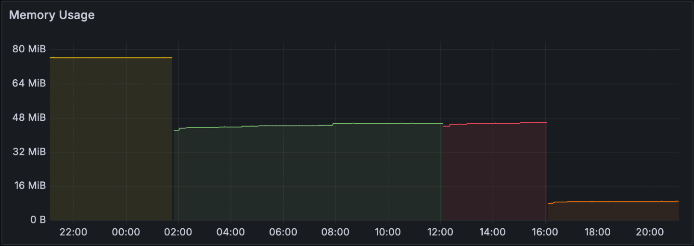
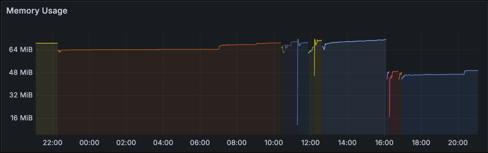

---
authors:
  - clux
date: 2024-06-11
description: >
  Free memory optimizations available in 0.92.0 for users of kube::runtime
---

# Watcher Memory Improvements

In [0.92.0](https://github.com/kube-rs/kube/releases/tag/0.92.0), the [watcher] dropped its internal buffering of state and started to fully delegating any potential buffering to the associated [Store].

This can cause a decent memory use reduction for direct users of [watcher], but also (somewhat unintuitively) for users of reflectors and stores.

In this post, we explore the setup, current solutions, and some future work.

<!-- more -->

## Runtime Memory Performance

The memory profile of any application using `kube::runtime` is often dominated by the memory usage from buffers of the Kubernetes objects that is needed to be watched. The main offender is the [reflector], with a literal `type Cache<K> = Arc<RwLock<AHashMap<ObjectRef<K>, Arc<K>>>>` hiding internally as the lookup used by [Store]s and [Controller]s.

We have lots of advice on how to __reduce the size of this cache__. The [[optimization]] guide shows how to:

- **minimize what you watch** :: by constraining watch parameters with selectors
- **minimize what you ask for** :: use [metadata_watcher] on watches that does not need the .spec
- **minimize what you store** :: by dropping fields before sending to stores

These are quick and easy steps improve the memory profile that is worth checking out (the benefits of doing these will further increase in 0.92).

Improving what is stored in the `Cache` above is important, but it is not the full picture...

## The Watch API

The Kubernetes watch API is an interesting beast. You have no guarantees you'll get every event, and you must be able to restart from a potentially new checkpoint without telling you what changes happened in the downtime. This is mentioned briefly in [Kubernetes API concepts](https://kubernetes.io/docs/reference/using-api/api-concepts/#efficient-detection-of-changes) as an implication of its `410 Gone` responses.

When `410 Gone` responses happen we need to trigger a re-list, and wait for all data to come through before we are back in a "live watching" mode that is caught up with reality. This type of API consumption is problematic when you need to do work with reflectors/caches where you are generally storing __complete__ snapshots in memory for a worker task. Controllers are effectively forced to treat every event as a potential change, and chase [[reconciler#idempotency]] as a work-around for not having guaranteed delivery.

Let's focus on caches. To simplify these problems for users we have created certain guarantees in the abstractions of `kube::runtime`.

## Guarantees

The [watcher] up until 0.92.0 has maintained a guarantee we have casually referred to as __watcher atomicity__:

!!! note "watcher atomicity < 0.92.0"

    You only see a `Restarted` on re-lists once every object has been received through an `api.list`.
    Watcher events will pause between a de-sync / restart and a `Restarted`. See [watcher::Event@0.91](https://docs.rs/kube/0.91.0/kube/runtime/watcher/enum.Event.html).

This property meant that stores could in-turn provide their own guarantee very easily:

!!! note "Store completeness"

    [Store] always presents the full state once initialised. During a relist, previous state is presented.
    There is no down-time for a store during relists, and its `Cache` is replaced __atomically__ in a single locked step.

This property is needed for Controllers who rely on complete information and will kick in once the future from [Store::wait_until_ready] resolves.

## Consequences

If we do all the buffering on the `watcher` side, then achieving the store completeness guarantee is a rather trivial task to accomplish.

Up until 0.91 this was handled in [`Store::apply_watcher_event@0.91`](https://github.com/kube-rs/kube/blob/5dbae3a18c14a225d2d993b9effd16147fef420e/kube-runtime/src/reflector/store.rs#L96-L121) as:

```rust
// 0.91 source:
        match event {
            watcher::Event::Applied(obj) => {
                let key = obj.to_object_ref(self.dyntype.clone());
                let obj = Arc::new(obj.clone());
                self.store.write().insert(key, obj);
            }
            watcher::Event::Deleted(obj) => {
                let key = obj.to_object_ref(self.dyntype.clone());
                self.store.write().remove(&key);
            }
            watcher::Event::Restarted(new_objs) => {
                let new_objs = new_objs
                    .iter()
                    .map(|obj| (obj.to_object_ref(self.dyntype.clone()), Arc::new(obj.clone())))
                    .collect::<AHashMap<_, _>>();
                *self.store.write() = new_objs;
            }
        }
```

Thus, on a relist/restart:

1. watcher pages were [buffered internally](https://github.com/kube-rs/kube/blob/5dbae3a18c14a225d2d993b9effd16147fef420e/kube-runtime/src/watcher.rs#L119-L124)
2. entered `Restarted` arm, where each object got cloned while creating `new_objs`
3. store (containing the complete old data) swapped at the very end

so you have a moment with **3x** potential peak memory use (**2x** should have been the max).

On top of that, the buffer in the `watcher` was not always released (quote from [discord](https://discord.com/channels/500028886025895936/1234736869317673022)):

> The default system allocator never returns the memory to the OS after the burst, even if the objects are dropped. Since the initial list fetch happens sporadically you get a higher RSS usage together with the memory spike. Solving the burst will solve this problem, and reflectors and watchers can be started in parallel without worrying of OOM killers.
> The allocator does not return the memory to the OS since it treats it as a cache. This is mitigated by using jemalloc with some tuning, however, you still get the memory burst so our solution was to use jemalloc + start the watchers sequentially. As you can imagine it's not ideal.

So in the end you might actually be holding on to between 2x and 3x the actual store size at all times.

!!! note "watcher guarantee was designed for the store guarantee"

    If you were using `watcher` without `reflector`, you were the most affected by this excessive caching. You might not have needed __watcher atomicity__, as it was primarily designed to facilitate __store completeness__.

## Change in 0.92

The change in 0.92.0 is primarily to **stop buffering events in the `watcher`**, and present __new watcher events__ that allows a store to achieve the Store completeness guarantee.

As it stands the [`Store::apply_watcher_event@0.92`](https://github.com/kube-rs/kube/blob/0ac1d07d073cc261af767c7f2b9bbf0629fca323/kube-runtime/src/reflector/store.rs#L99-L136) now is slightly smarter and achieves the same guarantee:

```rust
// 0.92 source
        match event {
            watcher::Event::Apply(obj) => {
                let key = obj.to_object_ref(self.dyntype.clone());
                let obj = Arc::new(obj.clone());
                self.store.write().insert(key, obj);
            }
            watcher::Event::Delete(obj) => {
                let key = obj.to_object_ref(self.dyntype.clone());
                self.store.write().remove(&key);
            }
            watcher::Event::Init => {
                self.buffer = AHashMap::new();
            }
            watcher::Event::InitApply(obj) => {
                let key = obj.to_object_ref(self.dyntype.clone());
                let obj = Arc::new(obj.clone());
                self.buffer.insert(key, obj);
            }
            watcher::Event::InitDone => {
                let mut store = self.store.write();
                std::mem::swap(&mut *store, &mut self.buffer);
                self.buffer = AHashMap::new();
                /// ...
            }
        }
```

Thus, on a restart, objects are passed one-by-one up to the store, and buffered therein. When all objects are received, the buffers are swapped (meaning you use at most 2x the data). The blank buffer re-assignment [also forces de-allocation](https://github.com/kube-rs/kube/pull/1494#discussion_r1602840218) of the temporary `self.buffer`.

!!! note "Preparing for StreamingLists"

    Note that the new partial `InitApply` event only pass up __individual__ objects, not pages. This is to prepare for the [1.27 Alpha StreamingLists](https://kubernetes.io/docs/reference/using-api/api-concepts/#streaming-lists) feature which also passed individual events. Once this becomes available for even our minimum [[kubernetes-version]] we can make this the default - reducing page buffers further - exposing the literal api results rather than pages (of [default 500 objects](https://docs.rs/kube/0.91.0/kube/runtime/watcher/struct.Config.html#structfield.page_size)). In the mean time, we send pages through item-by-item to avoid a breaking change in the future (and also to avoid exposing the confusing concept of flattened/unflattened streams).

## Results

The initial [synthetic benchmarks](https://github.com/kube-rs/kube/pull/1494#issue-2292501600) saw 60% reductions when using stores, and 80% when not using stores (when there's nothing to cache), with further incremental improvements when using the `StreamingList` strategy.

!!! warning "Ad-hoc Benchmarks"

    Whether the ad-hoc synthetic benchmarks are in any way realistic going forwards remains to be seen. How much you can get likely depends on a range of factors from allocator choice to usage patterns.

__So far__, we have seen controllers with a basically unchanged profile, some with small improvements in the 10-20% range, one [50% drop in a real-world controller](https://github.com/kube-rs/kube/pull/1494#issuecomment-2126694967) from testing, the same controller dropping 80% with page tuning (see below).

If you are using the standard `ListWatch` [InitialListStrategy], the default [Config::page_size] of `500` will undermine this optimization, because individual pages are still kept in the watcher while they are being sent out one-by-one. Setting the page size to `50` has been necessary for me to get anything close to the benchmarks.

So for now; YMMV. Try setting the `page_size`, and [chat about](https://discord.gg/tokio) / [share](https://github.com/kube-rs/kube/discussions) your results!

### Examples
Two examples from my own deployment testing today (plots of kubelet cpu metrics from [compute dashboards](https://github.com/kubernetes-monitoring/kubernetes-mixin)).

#### Optimized Metadata Controller
A metadata controller watching 2000 objects (all in stores), doing 6000 reconciles an hour, using **9MB of RAM**.



Yellow == `0.91.0`, green/red = `0.92.0` with defaults, orange = `0.92.0` with reduced page size (50).

This has seen the biggest change, dropping ~85% of its memory usage, but it also is also doing all the biggest [[optimization]] tricks (`metadata_watcher`, page_size 50, pruning of managed fields), and it has basically no other cached data.

#### KS Controller
A controller for [flux kustomizations](https://fluxcd.io/flux/components/kustomize/kustomizations/) storing and reconciling about 200 `ks` objects without any significant optimization techniques.


LHS == `0.91.0`, middle = `0.92.0` with defaults (many spot instance pods), RHS from 16:00 is `0.92.0` with reduced page size (50).

This controller saw a ~30% improvement overall, but not until reducing the page size. I assume this did not see any default improvement because the 200 objects fit comfortably within a single page and were cached internally in the `watcher` as before.

## Thoughts for the future

The peak 2x overhead here does hint at a potential future optimization; allowing users to opt-out of the _store completeness_ guarantee.

!!! note "Store Tradeoffs"

    It is possibly to build custom stores that avoids the buffering of objects on restarts by dropping the store completeness guarantee. This is not practical yet for `Controller` uses, due to requirements on `Store` types, but perhaps this could be made generic/opt-out in the future. It could be a potential flattener of the peak usage.

As a step in the right direction, we would first like to get better visibility of our memory profile with some automated benchmarking. See [kube#1505](https://github.com/kube-rs/kube/issues/1505) for details.

## Breaking Change

Users not matching on `watcher::Event` or building custom stores should not ever need to interact with this and should get the memory improvements for free.

If you are using a custom store **please see the new [watcher::Event]** and make the following changes in `match` arms:

- `Applied` -> `Apply`
- `Deleted` -> `Delete`
- `Restarted` -> change to `InitApply` with 2 new arms:
    * Create new arms for `Init` marking start (allocate a temporary buffer)
    * buffer objects from `InitApply` (you get one object at a time, no need to loop)
    * Swap store in `InitDone` and deallocate the old buffer

See the above `Store::apply_watcher_event` code for pointers.

## Previous Improvements
Memory optimization is a continuing saga and while the numbers herein are considerable, they build upon previous work:

1. Metadata API support in [0.79.0](https://github.com/kube-rs/kube/releases/tag/0.79.0)
2. Ability to pass minified streams into `Controller` in [0.81.0](https://github.com/kube-rs/kube/releases/tag/0.81.0) documented in [[streams]]
3. `Controller::owns` relation moved to lighter metadata watches in [0.84.0](https://github.com/kube-rs/kube/releases/tag/0.84.0)
4. Default pagination of watchers in [0.84.0](https://github.com/kube-rs/kube/releases/tag/0.84.0) via [#1249](https://github.com/kube-rs/kube/pull/1249)
5. initial streaming list support in [0.86.0](https://github.com/kube-rs/kube/releases/tag/0.86.0)
6. Remove buffering in watcher in [0.92.0](https://github.com/kube-rs/kube/releases/tag/0.92.0) - today 🎉

Thanks to everyone who contribute to `kube`!


--8<-- "includes/abbreviations.md"
--8<-- "includes/links.md"
