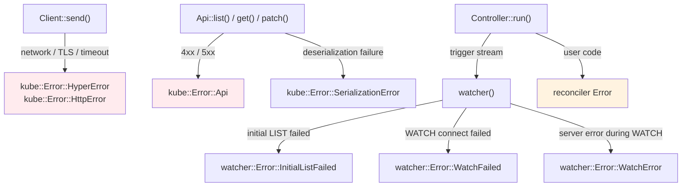

# Error Handling

Errors in kube originate from multiple layers. Understanding where each error comes from and how to handle it is key to building resilient controllers.

## Error Layers



| Layer | Error type | Typical cause |
|-------|-----------|---------------|
| Client | `HyperError`, `HttpError` | Network, TLS, timeout |
| [Api] | `Error::Api { status }` | Kubernetes 4xx/5xx response |
| [Api] | `SerializationError` | JSON deserialization failure |
| [watcher] | `InitialListFailed` | Initial LIST call failed |
| [watcher] | `WatchFailed` | WATCH connection failed |
| [watcher] | `WatchError` | Server error during WATCH (e.g. 410 Gone) |
| [Controller] | reconciler Error | Error from user code |

## Watcher Errors and Backoff

Watcher errors are **soft errors** — the [watcher] retries on all failures (including 403s, network issues) because external circumstances may improve. They should never be silently discarded. See the [troubleshooting page](../troubleshooting.md#watcher-errors) for diagnostic examples.

The critical requirement is attaching a backoff to the watcher stream:

```rust
// ✗ First error terminates the stream → controller stops
let stream = watcher(api, wc);

// ✓ Exponential backoff with automatic retry
let stream = watcher(api, wc).default_backoff();
```

### default_backoff

Applies an `ExponentialBackoff`: 800ms → 1.6s → 3.2s → ... → 30s (max). The backoff resets whenever a successful event is received.

### Custom backoff

```rust
use backon::ExponentialBuilder;

let stream = watcher(api, wc).backoff(
    ExponentialBuilder::default()
        .with_min_delay(Duration::from_millis(500))
        .with_max_delay(Duration::from_secs(30)),
);
```

## Reconciler Errors

### Defining error types

[Controller::run] requires specific trait bounds on the error type, so `anyhow::Error` cannot be used directly. Define a concrete error type with [thiserror]:

```rust
#[derive(Debug, thiserror::Error)]
enum Error {
    #[error("Kubernetes API error: {0}")]
    KubeApi(#[from] kube::Error),

    #[error("Missing spec field: {0}")]
    MissingField(String),

    #[error("External service error: {0}")]
    External(String),
}
```

### error_policy

When the reconciler returns `Err`, the `error_policy` function decides what happens next:

```rust
fn error_policy(obj: Arc<MyResource>, err: &Error, ctx: Arc<Context>) -> Action {
    tracing::error!(?err, "reconcile failed");
    Action::requeue(Duration::from_secs(5))
}
```

You can distinguish transient from permanent errors:

| Type | Examples | Handling |
|------|----------|---------|
| Transient | Network error, timeout, 429 | Requeue via `error_policy` |
| Permanent | Invalid spec, bad config | Record condition on status + `Action::await_change()` |

```rust
fn error_policy(obj: Arc<MyResource>, err: &Error, ctx: Arc<Context>) -> Action {
    match err {
        // Transient: retry
        Error::KubeApi(_) | Error::External(_) => {
            Action::requeue(Duration::from_secs(5))
        }
        // Permanent: don't retry until the object changes
        Error::MissingField(_) => Action::await_change(),
    }
}
```

!!! note "Current limitations"

    `error_policy` is a **synchronous** function. You cannot perform async operations (sending metrics, updating status) inside it. For per-key exponential backoff, wrap the reconciler itself — see the pattern described in the [[reconciler]] documentation.

## Client-level Retry

kube-client does not include built-in retry for regular API calls. If a `create()`, `patch()`, or `get()` fails, the error is returned as-is.

For automatic retry, you can use [tower]'s retry middleware. However, not all errors are retryable:

| Error | Retryable | Reason |
|-------|-----------|--------|
| 5xx | Yes | Server-side transient failure |
| Timeout | Yes | Temporary network issue |
| 429 Too Many Requests | Yes | Rate limit — wait and retry |
| Network error | Yes | Temporary connectivity failure |
| 4xx (400, 403, 404) | No | The request itself is wrong |
| 409 Conflict | No | SSA ownership conflict — fix the logic |

## Timeout Strategy

The default `read_timeout` on [Client] is 295 seconds (matching the Kubernetes server-side watch timeout). This means a regular [Api] call could block for nearly 5 minutes if the server is unresponsive.

### Separate clients

```rust
// Watcher client (default 295s timeout — needed for watch)
let watcher_client = Client::try_default().await?;

// API call client (short timeout)
let mut config = Config::infer().await?;
config.read_timeout = Some(Duration::from_secs(15));
let api_client = Client::try_from(config)?;
```

### Wrapping individual calls

```rust
let pod = tokio::time::timeout(
    Duration::from_secs(10),
    api.get("my-pod"),
).await??;
```

### Controllers

In a [Controller] context, the watcher needs the long timeout. Only the API calls inside your reconciler need shorter timeouts. Wrapping individual reconciler calls with `tokio::time::timeout` is usually sufficient.

--8<-- "includes/abbreviations.md"
--8<-- "includes/links.md"

[//begin]: # "Autogenerated link references for markdown compatibility"
[reconciler]: reconciler "The Reconciler"
[//end]: # "Autogenerated link references"
