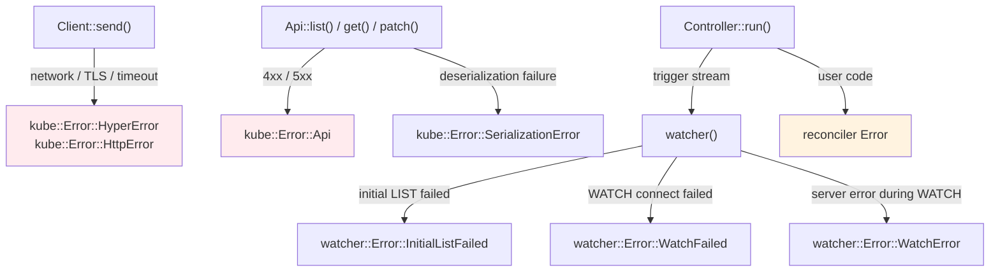

# Error Handling

Errors in kube originate from multiple layers. Understanding where each error comes from and how to handle it is key to building resilient controllers.

## Error Layers



| Layer | Error type | Typical cause |
|-------|-----------|---------------|
| Client | `HyperError`, `HttpError` | Network, TLS, timeout |
| [Api] | `Error::Api { status }` | Kubernetes 4xx/5xx response |
| [Api] | `SerializationError` | JSON deserialization failure |
| [watcher] | `InitialListFailed` | Initial LIST call failed |
| [watcher] | `WatchFailed` | WATCH connection failed |
| [watcher] | `WatchError` | Server error during WATCH (e.g. 410 Gone) |
| [Controller] | reconciler Error | Error from user code |

## Watcher Errors and Backoff

Watcher errors are **soft errors** — the [watcher] retries on all failures (including 403s, network issues) because external circumstances may improve. They should never be **silently** discarded. See the [troubleshooting page](../troubleshooting.md#watcher-errors) for diagnostic examples.

The critical requirement is attaching a backoff to the watcher stream:

```rust
// ✗ Without backoff, errors cause a tight retry loop
let stream = watcher(api, wc);

// ✓ Exponential backoff with automatic retry
let stream = watcher(api, wc).default_backoff();
```

### default_backoff

Applies an `ExponentialBackoff`: 800ms → 1.6s → 3.2s → ... → 30s (max). The backoff resets whenever a successful event is received.

### Custom backoff

```rust
use backon::ExponentialBuilder;

let stream = watcher(api, wc).backoff(
    ExponentialBuilder::default()
        .with_min_delay(Duration::from_millis(500))
        .with_max_delay(Duration::from_secs(30)),
);
```

## Reconciler Errors

### Defining error types

[Controller::run] requires specific trait bounds on the error type, so `anyhow::Error` cannot be used directly. Define a concrete error type with [thiserror]:

```rust
#[derive(Debug, thiserror::Error)]
enum Error {
    #[error("Kubernetes API error: {0}")]
    KubeApi(#[from] kube::Error),

    #[error("Missing spec field: {0}")]
    MissingField(String),

    #[error("External service error: {0}")]
    External(String),
}
```

### error_policy

When the reconciler returns `Err`, the `error_policy` function decides what happens next:

```rust
fn error_policy(obj: Arc<MyResource>, err: &Error, ctx: Arc<Context>) -> Action {
    tracing::error!(?err, "reconcile failed");
    Action::requeue(Duration::from_secs(5))
}
```

You can distinguish transient from permanent errors:

| Type | Examples | Handling |
|------|----------|---------|
| Transient | Network error, timeout, 429 | Requeue via `error_policy` |
| Permanent | Invalid spec, bad config | Record condition on status + `Action::await_change()` |

```rust
fn error_policy(obj: Arc<MyResource>, err: &Error, ctx: Arc<Context>) -> Action {
    match err {
        // Transient: retry
        Error::KubeApi(_) | Error::External(_) => {
            Action::requeue(Duration::from_secs(5))
        }
        // Permanent: don't retry until the object changes
        Error::MissingField(_) => Action::await_change(),
    }
}
```

!!! note "Current limitations"

    `error_policy` is a **synchronous** function. You cannot perform async operations (sending metrics, updating status) inside it. For per-key exponential backoff, wrap the reconciler itself with a middleware that tracks per-object retry state.

## Client-level Retry

By default, kube-client does not retry regular API calls. If a `create()`, `patch()`, or `get()` fails, the error is returned as-is.

Since version 3, kube provides a built-in [`RetryPolicy`](https://docs.rs/kube/latest/kube/client/retry/struct.RetryPolicy.html) that implements [tower]'s retry middleware. It retries on 429, 503, and 504 with exponential backoff:

```rust
use kube::client::retry::RetryPolicy;
use tower::{ServiceBuilder, retry::RetryLayer, buffer::BufferLayer};

let service = ServiceBuilder::new()
    .layer(config.base_uri_layer())
    .option_layer(config.auth_layer()?)
    .layer(BufferLayer::new(1024))
    .layer(RetryLayer::new(RetryPolicy::default()))
    // ...
```

`RetryPolicy` specifically retries **429**, **503**, and **504** responses. It does not retry network errors or other 5xx codes.

For broader retry guidance when designing your own error handling:

| Error | Retryable | Where to handle |
|-------|-----------|-----------------|
| 429, 503, 504 | Yes | `RetryPolicy` handles automatically |
| Other 5xx | Depends | `error_policy` or custom Tower middleware |
| Timeout / Network | Yes | `error_policy` requeue, or watcher backoff |
| 4xx (400, 403, 404) | No | Fix the request or RBAC |
| 409 Conflict | No | SSA ownership conflict — fix field managers |

## Timeout Strategy

If you need to guard against slow API calls in your reconciler, you can wrap individual calls with `tokio::time::timeout`:

```rust
// First ? unwraps the timeout Result<T, Elapsed>
// Second ? unwraps the API Result<Pod, kube::Error>
let pod = tokio::time::timeout(
    Duration::from_secs(10),
    api.get("my-pod"),
).await??;
```

In a [Controller] context, stream timeouts rely internally on watcher timeouts and can be configured via stream backoff parameters and [watcher::Config]. Only individual API calls inside your reconciler typically need shorter timeouts.

--8<-- "includes/abbreviations.md"
--8<-- "includes/links.md"

[//begin]: # "Autogenerated link references for markdown compatibility"
[reconciler]: reconciler "The Reconciler"
[//end]: # "Autogenerated link references"
