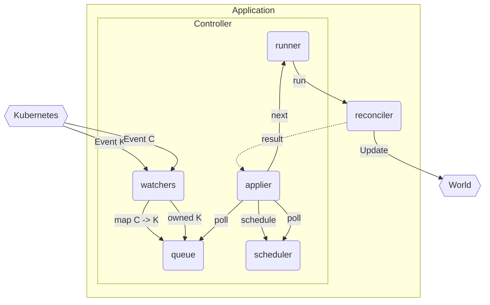

# Internals

This is a brief overview of [Controller] internals.

Suppose you have a `Controller` for a main [[object]] `K` which **owns** a child object `C`.

I.e. if `child_c` is an `Api<C>` and `main_k` is an `Api<K>`, then the following code sets up this basic scenario:

```rust
Controller::new(main_k, watcher::Config::default())
    .owns(child_c, watcher::Config::default())
    .run(reconcile, error_policy, context)
    .for_each(|_| futures::future::ready(()))
    .await
```

This `Controller` builder sets up a series of streams and links between them:



I.e. basic flow.

- `watcher`s poll the Kubernetes api for changes to configured objects (`K` and `C`)
- stream of events from each `watcher` needs to be turned into a stream of the same type
- streams of non K type run through mappers (`C` maps to `K` through [[relations]])
- initial queue created as the union of these streams

The `applier` then polls this stream and merges it further with previous reconciliation results (requeues for a later time). This forces the need for a `scheduler`.


## Queue

The queue is the stream of inputs.

It takes `N` main inputs (root object, related objects, external triggers), and it is our `trigger_selector`.

## Scheduler

The `scheduler` wraps the object to be reconciled in a `future` that will resolve when its associated timer is up.

All reconcile requests go through this, but only requeues are delayed significantly.

## Applier

The [applier] is the most complicated component on the diagram because it is in charge of juggling the various input streams, invoking the scheduler and runner, and also somehow produce a stream of reconcile results at the same time.

The flow of doing this is quite complicated in rust so the way this is done internally is likely subject to change in the long run. Please refer to the source of the [applier] for more details.

It is possible to set up the controller machinery yourself by creating the queue yourself from watchers and then calling the `applier` with the queue injected, but this is not recommended.


--8<-- "includes/abbreviations.md"
--8<-- "includes/links.md"

[//begin]: # "Autogenerated link references for markdown compatibility"
[object]: object "The Object"
[relations]: relations "Relations"
[//end]: # "Autogenerated link references"
