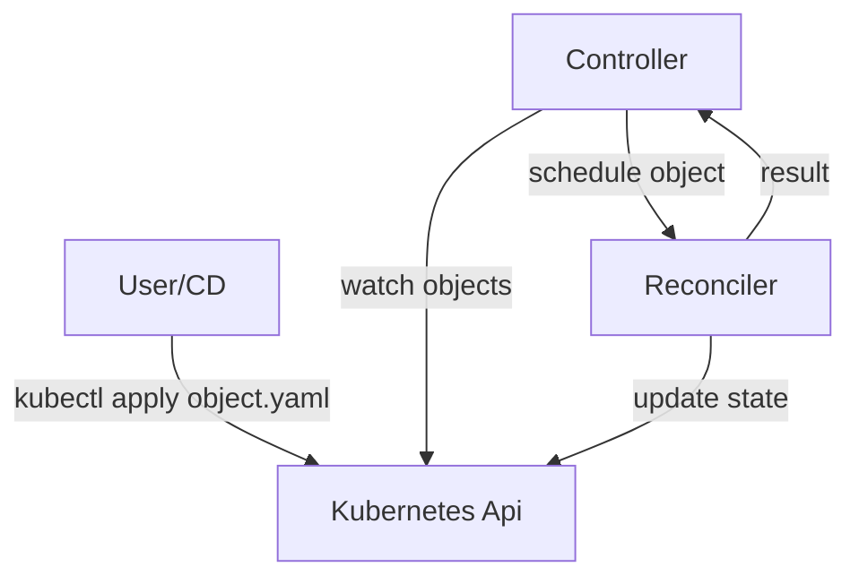

# Introduction

This guide showcases how to build controllers with kube-rs, and is a WIP with a [progress issue](https://github.com/kube-rs/website/issues/5).

## Overview

A controller a long-running program that ensures the kubernetes state of an object, matches the state of the world.

As users update the desired state, the controller sees the change and schedules a reconciliation, which will update the state of the world:



any unsuccessful reconciliations are retried or requeued, so a controller should **eventually** apply the desired state to the world.

Writing a controller requires **three** pieces:

- an **object** dictating what the world should see
- an **reconciler** function that ensures the state of one object is applied to the world
- an **application** living in kubernetes watching the object and related objects

## The Object

The main object is the source of truth for what the world should be like, and it takes the form of a Kubernetes object like a:

- [Pod](https://arnavion.github.io/k8s-openapi/v0.14.x/k8s_openapi/api/core/v1/struct.Pod.html)
- [Deployment](https://arnavion.github.io/k8s-openapi/v0.14.x/k8s_openapi/api/apps/v1/struct.Deployment.html)
- ..[any native Kubernetes Resource](https://arnavion.github.io/k8s-openapi/v0.14.x/k8s_openapi/trait.Resource.html#implementors)
- a partially typed or dynamically typed Kubernetes Resource
- an object from [api discovery](https://docs.rs/kube/latest/kube/discovery/index.html)
- a [Custom Resource](https://kubernetes.io/docs/tasks/extend-kubernetes/custom-resources/custom-resource-definitions/)

Kubernetes already has a [core controller manager](https://kubernetes.io/docs/reference/command-line-tools-reference/kube-controller-manager/) for the core native objects, so the most common use-case for controller writing is a **Custom Resource**, but many more fine-grained use-cases exist. <!-- TODO: talk about use cases? -->

See the [[object]] document for how to use the various types.

## The Reconciler

The reconconciler is the part of the controller that ensures the world is up to date.

It takes the form of an `async fn` taking the object along with some context, and performs the alignment between the state of world and the `object`.

In its simplest form, this is what a reconciler (that does nothing) looks like:

```rust
async fn reconcile(object: Arc<MyObject>, data: Context<Data>) ->
    Result<ReconcilerAction, Error>
{
    // TODO: logic here
    Ok(ReconcilerAction {
        requeue_after: Some(Duration::from_secs(3600 / 2)),
    })
}
```

As a controller writer, your job is to complete the logic that align the world with what is inside the `object`.
The core reconciler must at **minimum** contain **mutating api calls** to what your `object` is meant to manage, and in some situations, handle annotations management for [ownership](https://kubernetes.io/docs/concepts/overview/working-with-objects/owners-dependents/) or [garbage collection](https://kubernetes.io/docs/concepts/overview/working-with-objects/finalizers/).

Writing a goood **idempotent reconciler** is the most difficult part of the whole affair, and its difficulty is the reason we generally provide diagnostics and observability:

See the [[reconciler]] document for a run-down with all the best-practices.

## The Application

The controller application is the part that watches for changes, determines what root object needs reconciliations, and then schedules reconciliations for those changes. It is the glue that turns what you want into __something__ running in Kubernetes.

In this guide; the **application** is written in [rust], using the [kube] crate as a **dependency** with the `runtime` feature, compiled into a **container**, and deployed in Kubernetes as a **`Deployment`**.

The core features inside the application are:

- an encoding of the main object + relevant objects
- an infinite [watch loop](https://kubernetes.io/docs/reference/using-api/api-concepts/#efficient-detection-of-changes) around relevant objects
- a system that maps object changes to the relevant main object
- an **idempotent reconciler** acting on a main object

The system must be **fault-tolerant**, and thus must be able to recover from **crashes**, **downtime**, and resuming even having **missed messages**.

Setting up a blank controller in rust satisfying these constraints is fairly simple, and can be done with minimal boilerplate (no generated files need be inlined in your project).

See the [[application]] document for the high-level details.

## Controllers and Operators

The terminology between **controllers** and **operators** are quite similar:

1. Kubernetes uses the following [controller terminology](https://kubernetes.io/docs/concepts/architecture/controller/):

> In Kubernetes, controllers are **control loops** that watch the **state** of your cluster, then make or request **changes where needed**. Each controller tries to move the current cluster state closer to the desired state.

2. The term **operator**, on the other hand, was originally introduced by `CoreOS` as:

> An Operator is an application-specific controller that extends the Kubernetes API to create, configure and manage instances of complex stateful applications on behalf of a Kubernetes user. It builds upon the basic Kubernetes resource and controller concepts, but also includes domain or application-specific knowledge to automate common tasks better managed by computers.

Which is further reworded now under their new [agglomerate banner](https://cloud.redhat.com/learn/topics/operators).

They key **differences** between the two is that **operators** generally a specific type of controller, sometimes more than one in a single application. A controller would at the very least need to:

- manage custom resource definition(s)
- maintain single app focus

to be classified as an operator.

The term **operator** is a flashier term that makes the **common use-case** for user-written CRD controllers more understandable. If you have a CRD, you likely want to write a controller for it ([otherwise why](https://kubernetes.io/docs/concepts/configuration/configmap/) go through the effort of making a custom resource?).

## Guide Focus

Our goal is that with this guide, you will learn how to use and apply the various controller patterns, so that you can avoid scaffolding out a large / complex / underutilized structure.

We will focus on all the patterns as to not betray the versatility of the Kubernetes API, because components found within complex controllers can generally be mixed and matched as you see fit.

We will focus on how the variour element **composes** so you can take advantage of any controller archetypes - operators included.

--8<-- "includes/abbreviations.md"
--8<-- "includes/links.md"

[//begin]: # "Autogenerated link references for markdown compatibility"
[object]: object "The Object"
[reconciler]: reconciler "The Reconciler"
[application]: application "The Application"
[//end]: # "Autogenerated link references"
