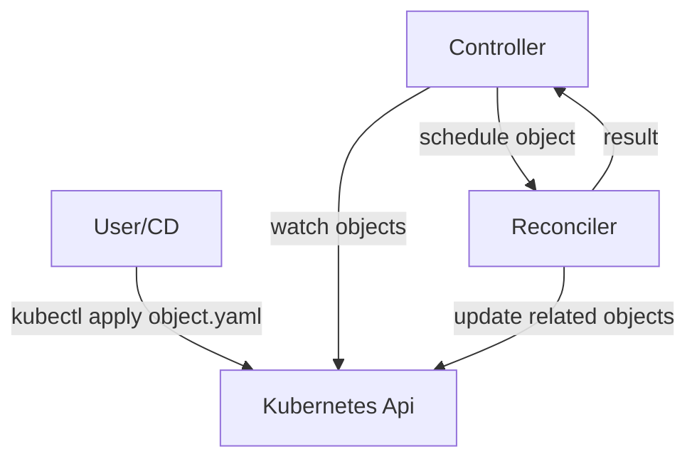

# Introduction

This chapter contains information on how to build controllers with kube-rs.

A controller consist of three pieces:

- a main object dictating what the world should see (the **object**)
- an application running inside kubernetes watching the spec and related objects (the **application**)
- an idempotent function that ensures the state of one object is applied to the world (the **reconciler**)

In short:

> A controller a long-running program that ensures the kubernetes state of an object, matches the state of the world.

It ensures this by watching the object, and reconciling any differences when they occur:



The controller picks up on related changes from the kubernetes api, then starts **reconciling** the main object. The reconciliation process updates the state of world, and the outcome is fed back into the reconciler for retries/requeing.

## The Object

The main object is the source of truth for what the world should be like, and it takes the form of one or more Kubernetes objects, like say a:

- [Pod](https://arnavion.github.io/k8s-openapi/v0.14.x/k8s_openapi/api/core/v1/struct.Pod.html)
- [Deployment](https://arnavion.github.io/k8s-openapi/v0.14.x/k8s_openapi/api/apps/v1/struct.Deployment.html)
- ..[any native Kubernetes Resource](https://arnavion.github.io/k8s-openapi/v0.14.x/k8s_openapi/trait.Resource.html#implementors)
- a dynamic object from [api discovery](https://docs.rs/kube/latest/kube/discovery/index.html)
- a [Custom Resource](https://kubernetes.io/docs/tasks/extend-kubernetes/custom-resources/custom-resource-definitions/)

Because Kubernetes already a [core controller manager](https://kubernetes.io/docs/reference/command-line-tools-reference/kube-controller-manager/) for the core native objects, the most common use-case is Custom Resources, but the process outlined herein system works equally well for all resources.

See the [[object]] section for how to use the various types.

## The Application

The job of the controller application is simply to watch the core object(s), and any related objects for changes, and then relay the information to the reconciler.

The application, as far as this guide is concerned, takes the form of a **rust application** using the `kube` crate as a **dependency** with the `runtime` feature, compiled into a **container**, and deployed in kubernetes as a **`Deployment`**.

The core components inside the application are:

- infinite [watch loops](https://kubernetes.io/docs/reference/using-api/api-concepts/#efficient-detection-of-changes) around relevant objects
- a system that maps object changes to the relevant specification
- one or more **idempotent reconcilers** acting on a single object

And because of Kubernetes constraints; the system must be **fault-tolerant**. It must be able to recover from **crashes**, **downtime**, and resuming even having **missed messages**.

Setting up a blank controller in rust is fairly simply, can be done with minimal boilerplate (no generated files need be inlined in your project), and will be covered in TODO: APPLICATIONDOC.

The hard part of writing a controller lies in the business logic: the reconciler.

## The Reconciler

In its simplest form, this is what a noop reconciler (a reconciler that does nothing) looks like:

```rust
async fn reconcile(object: Arc<MyObject>, data: Context<Data>) -> Result<ReconcilerAction, Error> {
    Ok(ReconcilerAction {
        requeue_after: Some(Duration::from_secs(3600 / 2)),
    })
}
```

It takes the last seen version of your `object`, passes it to a user-defined function along with some user `data`, and then performs actions to align the world with `object`.

In practice the reconciler, is the warmest user-defined code in your controller, and it will end up doing a range of tasks including:

- extracting a `Client` or an `Api` from the `Data`
- performing mutating api calls to:
  * your `object`'s **child resources** / related resources
  * the `object`'s **status struct** for other api consumers of the object
  * the `Event` api for diagnostic information
- managing annotations for [ownership](https://kubernetes.io/docs/concepts/overview/working-with-objects/owners-dependents/) or [garbage collection](https://kubernetes.io/docs/concepts/overview/working-with-objects/finalizers/) within kubernetes
- handling instrumentation for tracing, logs and metrics

..and to make matters more confusing, sometimes controllers sit in front of the watch machinery and is in charge of [admission into Kubernetes](https://kubernetes.io/docs/reference/access-authn-authz/admission-controllers/).

We will go through all these details herein and you can compose the various techniques as you see fit depending on your use case.

## Controllers and Operators

The terminology between **controllers** and **operators** are quite similar:

1. Kubernetes uses the following [controller terminology](https://kubernetes.io/docs/concepts/architecture/controller/):

> In Kubernetes, controllers are **control loops** that watch the **state** of your cluster, then make or request **changes where needed**. Each controller tries to move the current cluster state closer to the desired state.

2. The term **operator**, on the other hand, was originally introduced by `CoreOS` as:

> An Operator is an application-specific controller that extends the Kubernetes API to create, configure and manage instances of complex stateful applications on behalf of a Kubernetes user. It builds upon the basic Kubernetes resource and controller concepts, but also includes domain or application-specific knowledge to automate common tasks better managed by computers.

Which is further reworded now under their new [agglomerate banner](https://cloud.redhat.com/learn/topics/operators).

They key **differences** between the two is that **operators** generally a specific type of controller, sometimes more than one in a single application. A controller would at the very least need to:

- manage custom resource definition(s)
- maintain single app focus

to be classified as an operator.

The term **operator** is thus a flashier word that makes the **common use-case** for user-written CRD controllers more understandable. If you have a CRD you likely want a controller for it.

## Guide Focus

Our goal is that with this guide, you will learn how to use and apply the various controller patterns, so that you can avoid scaffolding out a large / complex / underutilized structure.

We will focus on all the patterns as to not betray the versatility of the Kubernetes API, because components found within complex controllers can generally be mixed and matched as you see fit.

We will focus on how the variour element **composes** so you can take advantage of any controller archetypes - operators included.


[//begin]: # "Autogenerated link references for markdown compatibility"
[object]: object "The Object"
[//end]: # "Autogenerated link references"
