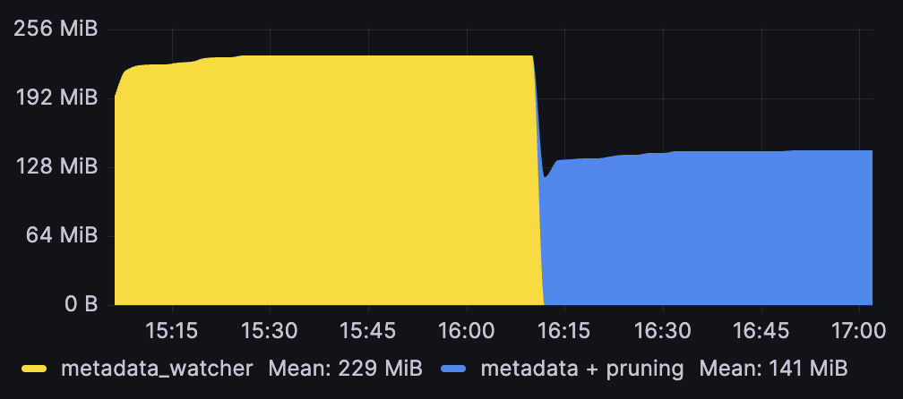
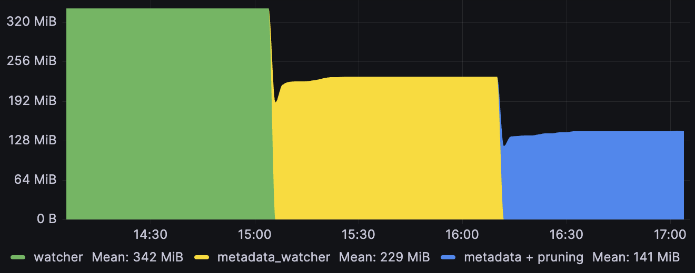
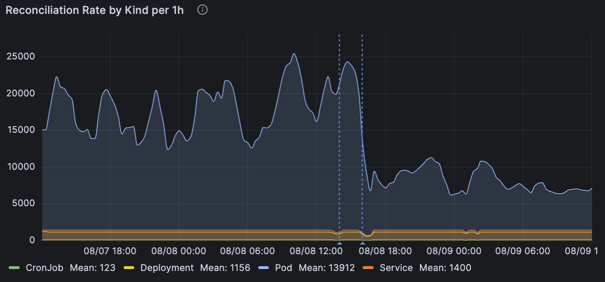

# Optimization

This document aims to help optimize various factors of resource consumption by controllers, and it will effectively be a guide on how to reduce the usage of your [watcher] streams to simplify things for downstream consumers.

## Watcher Optimization

One of the biggest contributor to activity in a [Controller] is the constant, long-polling watch of the min [[object]] and every related object by the use of multiple [watcher] streams created with some variant of:

```rust
let cfg = watcher::Config { RESTRICTIONS };
let stream = SOME_WATCHER(cfg).SOME_MODIFICATION();
```

By **default**, [watcher] streams are **implicitly configured** within the [Controller], but using the controller streams interface outlined in the **[[streams]] chapter**, you can customize every aspect of these streams.

The central premise herein is that **controllers benefit from customizing the input streams** and we will show how to do these configurations.

!!! warning "Streams Interface Required"

    The watcher optimizations here that directly call `watcher` / `metadata_watcher` require the unstable [[streams]] interface to interface with controllers.

Better watcher configuration primarily aim to reduce IO or networked traffic. However, when used in combination with [reflector] caches, they also become memory optimizations.

### Reducing Number of Watched Objects
The default `watcher::Config` will watch every object in the [Api] scope you configured:

- `Api::namespaced` or `Api::default_namespaced` -> all objects in that namespace
- `Api::all` -> all cluster scoped objects (or all objects in all namespaces)

This is easiest to do with [label selectors](https://kubernetes.io/docs/concepts/overview/working-with-objects/labels/#api) of [field selectors](https://kubernetes.io/docs/concepts/overview/working-with-objects/field-selectors/).

Field selectors __can__ be used to filter on certain common properties:

```rust
let cfg = watcher::Config::default().fields(&format!("metadata.name={name}"));
```

And allows explicitly __excluding__ lists of namespaces:

```rust
let ignoring_system_namespaces = [
    "cert-manager",
    "flux2",
    "linkerd",
    "linkerd-jaeger",
    "linkerd-smi",
    "linkerd-viz",
    "gatekeeper-system",
    "kube-node-lease",
    "kube-public",
    "kube-system",
]
.into_iter()
.map(|ns| format!("metadata.namespace!={ns}"))
.collect::<Vec<_>>()
.join(",");
let cfg = watcher::Config::default().fields(&ignoring_system_namespaces);
```

!!! note "Field Selector Limitations"

    Due to [field-selector](https://kubernetes.io/docs/concepts/overview/working-with-objects/field-selectors/) limitations, you cannot filter on arbitrary fields, nor can you do set operations, forcing explicit negative enumeration as one of the few helpful tricks.

A more general solution involves [explicitly labelling](https://kubernetes.io/docs/concepts/overview/working-with-objects/labels/) the objects you care about, and using the much more expressive [label selectors](https://kubernetes.io/docs/concepts/overview/working-with-objects/labels/#api) instead:

```rust
let cfg = Config::default().labels("environment in (production, qa)");
```

### Backoff on Errors

Implicitly created controller streams are always created with a [DefaultBackoff] `Backoff` implementation (from [backoff]) similar to the [defaults set by client-go](https://github.com/kubernetes/client-go/blob/980663e185ab6fc79163b1c2565034f6d58368db/tools/cache/reflector.go#L177-L181) to avoid hammering the apiserver when errors occur.

!!! warning "Use backoffs"

    A watcher that does not call `.default_backoff()` or setup any other form of `.backoff(b)` will **continuously loop** on errors. This generally spams your logs/traces, and can starve your controller and your apiserver of resources. On newer Kubernetes versions, such behaviour can get you [throttled](https://kubernetes.io/docs/concepts/cluster-administration/flow-control/#concepts).

When going from implicit controller streams to manually created streams, remember to add `.default_backoff()` at some point in the stream chain:

```rust
let stream = watcher(api, cfg).default_backoff();
```
### Watching Metadata Only

If you do not need all the data on the resource you are watching, then you should consider using the [[streams#Metadata-Watcher]] to reduce the amount of data being handled by your watch stream.

Metadata is generally responsible for a small amount of the total object size, so you can often expect a commensurate reduction in incoming bandwidth by only watching metadata. When these watches are sent through a [reflector] they will also **significantly reduce the reflector memory footprint**:


Note that this memory reduction can also be achieved through [[#pruning-fields]] - and you can potentially omit even more data that way by combining the approaches - but pruned data is still sent on the wire.

There are three pathways to consider when changing controller inputs to metadata watchers:

#### 1. Changing Associated Streams
> When watching an **associated** stream (via [[relations]]) that is only used for mapping and not stored.

If you are using normal watchers for these, then there is potentially a lot of unused data go on the wire. `Controller::owns_stream` should use `metadata_watcher` in general (ownerReference lookup only needs metadata), and `Controller::watches_stream` can also do this if its lookup is based on metadata properties. See [[streams#input-streams]].

#### 2. Changing Primary Streams
> When only metadata properties are acted on (e.g. you have a controller that only acts on labels/annotations or similar).

In this case you can replace the [[streams#main-stream]] for a significant memory reduction from the mandatory reflector. Do note the caveat that this changes the type signature of your reconciler slightly.

#### 3. Changing Predicated Primary Streams
> When running a controller with predicate_filters to limit the amount of reconciler hits, and simultaneously not using the cache for anything important.

In this case you can actually also follow the [[streams#main-stream]] pattern and call `Api::get` on the object name when the `reconcile` function actually calls so you get an up-to-date object. Remember that if you are using [predicates] on the long watch, then you can quickly discard many changes without requiring all of the data being transmitted.

Such a setup can involve running the metadata watcher with the cheaper/less consistent [any_semantic] because your reconciler only happens every so often, but when it does, you will do the work properly:

```rust
let deploys: Api<Deployment> = Api::all(client);
let cfg = watcher::Config::default().any_semantic();
let (reader, writer) = reflector::store();
let pred_cfg = PredicateConfig::default();
let stream = reflector(writer, metadata_watcher(api, cfg))
    .default_backoff()
    .applied_objects()
    .predicate_filter(predicates::generation, pred_cfg);

Controller::for_stream(stream, reader)...

async fn reconcile(partial: Arc<PartialObjectMeta<Deployment>>, ctx: Arc<Context>) -> Result<Action, Error>
{
    // if we are here, then we have a changed generation - fetch it fully
    let api: Api<Deployment> = Api::namespaced(partial.namespace(), ctx.client.clone());
    let deploy = api.get(&partial.name_any()).await?;

    unimplemented!()
}
```

This will also help avoid [[#Repeatedly Triggering Yourself]].

### Avoiding the List Spike

Because **continuous watch loops** (i.e. watchers) against the kube-apiserver requires an **initial listing of objects**, the watchers **peak memory footprint** is going to be dictated by how large those chunks of objects are when they arrive.

There are **two** methods to reduce this overhead (for both the apiserver and your controller), depending on what Kubernetes version you have.

### Page Size

On Kubernetes versions **<1.33**, the initial __listing__ of objects comes in the form of a `list` call, followed by a long `watch` starting at the given `resourceVersion` from the initial list.

On big clusters this listing is quite memory intensive (for both the apiserver and the controller), having lasting effects in form of map and vector [capacities](https://doc.rust-lang.org/std/vec/struct.Vec.html#method.capacity) getting set to values proportional to the [`Config::page_size`](https://docs.rs/kube/latest/kube/runtime/watcher/struct.Config.html#structfield.page_size).

The **default list page size** matches client-go's `500`, but this can be reduced further when working on large objects;

```rust
let cfg = watcher::Config::default().page_size(50);
```

### Streaming Lists

On Kubernetes >=1.33, the [Kubernetes Streaming List](https://kubernetes.io/blog/2025/05/09/kubernetes-v1-33-streaming-list-responses/) feature is generally available, and gives you all the initial objects as a stream meaning you do not have to allocate a vector per page.

These savings __can__ be significant (>50% reductions seen on lighter apps), but your savings may vary. When interacting with reflectors, you are storing the objects anyway, so if you were already setting page sizes low, you may not see much of an improvement.

This is currently **not** our default because it is still [beta upstream](https://kubernetes.io/docs/reference/using-api/api-concepts/#streaming-lists), but you can opt-in early for a bigger memory saving.

```rust
let cfg = watcher::Config::default().streaming_lists();
```

Note that this watch mode **avoids paging entirely**, and is a convenience helper to set the [Config::initial_list_strategy](https://docs.rs/kube/latest/kube/runtime/watcher/struct.Config.html#structfield.initial_list_strategy) to `StreamingList`.

## Reflector Optimization

Unless you have another large in-memory cache or other similar memory users in your controller, the **primary contributor** to your controller's memory use is going to be the **mandatory reflector** for the main [[object]] as well as any other **optional reflectors** for related objects.

The memory usage of reflectors is directly proportional to how much stuff you put in it, and can be minimized by tweaking a number of properties:

1. Amount of objects watched (`watcher::Config`)
2. Asking for only metadata (`metadata_watcher`)
3. Pruning unnecessary fields before storing (`WatchStreamExt`)

We have already talked about the first two points ([[#Reducing Number of Watched Objects]] and [[#Watching Metadata Only]]) above as these have IO benefits for watchers on their own, but also cause memory usage reductions by forcing less stored objects/data.


### Pruning Fields
By default, the memory stored for each object is equivalent to what you get from asking `kubectl` for all objects matching your `ListParams`, but additionally asking for `--show-managed-fields` which `kubectl` hides from you by default, but is always part of any underlying api based request.

Most controllers do not need to know about the specifics of these, and they should usually be pruned pre-insertion:

```rust
let api: Api<Pod> = Api::default_namespaced(client);
let stream = watcher(pods, watcher::Config::default()).modify(|pod| {
    // memory optimization for our store - we don't care about fields/annotations/status
    pod.managed_fields_mut().clear();
    pod.annotations_mut().clear();
    pod.status = None;
});
let (reader, writer) = reflector::store::<Pod>();
let rf = reflector(writer, stream).applied_objects();
```

In the above example we also clear out the status object and annotations entirely pre-storage.

This can be effective, even when already using [metadata_watcher], as managed-fields often accounts for close to half of the metadata yaml. Here is the result of clearing only managed fields from a roughly ~2000 object metadata reflector cache:



For reference, here is the full graph showing the effect of first switching from `watcher` to `metadata_watcher` (which effectively acts as a smarter way to prune the Spec/Status) on a 2000 object `Pod` reflector that adds managed field pruning on top:




Except for some of the .metadata properties  __pruning can generally be done for all the fields you do not care about__.

!!! warning "Pruning ObjectMeta"

    Do **not** prune **everything** from [ObjectMeta] as `kube::runtime` relies on being able to see `.metadata.name`, `.metadata.resourceVersion`, `.metadata.namespace` and in some cases `.metadata.ownerReferences`.

!!! note "Pruning will not reduce your network traffic"

    All object data passed through a `watcher` is always ultimately received over the wire from `kube-apiserver`. Pruning is only local truncation.

## Reconciler Optimization

The [[reconciler]] is generally the entry-point for your business logic, so we cannot give too much blanket advice on optimizing this, but we can give a few pointers.

Note that instrumenting standard metrics ([[observability#what-metrics]]) on your reconciler, and sending traces of more complicated microservice interactions to a trace collector ([[observability#instrumenting]]) are good [[observability]] practices, and can go a long way in identifying performance issues.

### Repeatedly Triggering Yourself

AKA the problem that you will most easily run into; a **reconciler that modifies the status** (say) of its main [[object]] will cause a change in that object that is picked up by the [Controller]'s watcher loop, and will be **fed back into the reconciler**.

This is normally not a problem, because **if** your status patch that causes this change is **idempotent**, it will **only happen once**. The problem is when you start putting non-deterministic values inside the the `.status` resource (e.g. timestamps rather than hashes).

In such cases, the **controller will spin forever** on such objects.

!!! note "Detecting spinlocks"

    Spinlocks are usually noticeable quickly by just running the controller locally and watching logs for one object, or having a plot graph on your reconciler rate ([[observability#what-metrics]]) in `grafana`. You should expect about 1 to 5+ reconciles every `1/(your requeue time)` growing with the number of affected objects and self-interaction.

The two ways to avoid reconciler re-triggering are:

1. don't patch in non-deterministic values to your object (breaks idempotency)
2. filter out changes to irrelevant parts of your object

These approaches are **both recommended** because they both have independent merits;

1. idempotency is good, and it avoids the spin problem the "good practice way"
2. early filtering can allow for more precise reconcile bypasses with less code complexity, and allow opt-in non-determinism (such as timestamp fields)

Watch events can be filtered out early using [predicates] with [WatchStreamExt::predicate_filter], and passing on these pre-filtered streams to controllers:

```rust
let deploys: Api<Deployment> = Api::default_namespaced(client);
let changed_deploys = watcher(deploys, watcher::Config::default())
    .applied_objects()
    .predicate_filter(predicates::generation);
```

### Debouncing Repetitions

After kube 0.86 (via [#1265](https://github.com/kube-rs/kube/pull/1265)) it is possible to [debounce](https://en.wiktionary.org/wiki/debounce) to filter out reconcile calls that happen quick succession (only taking the latest). A debounce time can be set on the [controller::Config], and will __introduce a delay__ between the observed event and the eventual reconcile call, triggering __only after__ no relevant events have been seen for the debounce period.

```rust
Controller::new(pods, watcher::Config::default())
    .with_config(controller::Config::default().debounce(Duration::from_secs(5)))
```

A common example is to lessen the noise from rapid [phase](https://kubernetes.io/docs/concepts/workloads/pods/pod-lifecycle/#pod-phase) transitions of `Pod` watches (which receives several repeat status updates after initial application). If your controller only treats pods as a watched resource and does not need to react to every status update, then introducing a handful of seconds of debounce time can help reduce reconciler load:



The graph shows how a `5s` debounce acts on reconciliation rates for various workloads (via 4 different controllers) in a cluster with ~1500 pods (the last dashed line indicates a deployment of the controller that enabled debounce).

!!! warning "Debounce effect is situational and will slow down responsiveness"

    As can be seen from the generally completely unaffected other kinds in the above graph, the effect may not benefit all controllers, and a downside is that it will slow down the controller's average response time to changes. A few seconds can be helpful while waiting for other eventually-consistent components, but beyond that you should consider the tradeoff between the **consistency loss** and the **cost of re-running**.

See the documentation for [controller::Config] for more information.

### Reconciler Concurrency

The controller will schedule **different objects** concurrently. For example, for the event queue ABA, we'd currently schedule object A and B to reconcile concurrently, and start the second reconciliation of A as soon as the first one finishes. Our guarantee here is that __kube will never run two reconciliations for the same object concurrently__. This means that default kube behaviour is __infinite concurrency__ whereas `controller-runtime` has [no default concurrency](https://github.com/kubernetes-sigs/controller-runtime/blob/aa9f8c9e8ef099910ff36031ccafe900fe31d9e1/pkg/controller/controller.go#L39-L40).

On large datasets, spiky workloads can occur with this default. Big datasets being funnelled through the `watcher` and into the reconciler can cause large amount of work, and when using consistent requeue times, that same spike is likely to show up later:


To flatten such a workload curve, consider limiting your `concurrency` to control how much work can happen at the same time.

```rust
Controller::new(pods, watcher::Config::default())
    .with_config(controller::Config::default().concurency(3))
```

!!! note "Reconciler Deduplication"

    Multiple repeat reconciliations for the same object are **deduplicated** if they are queued but haven't been started yet. For example, a queue for two objects that is meant to run `ABABAAAAA` will be deduped into a shorter queue `ABAB`, assuming that `A1` and `B1` are still executing when the subsequent entries come in.

## Future Optimizations

Not everything is possible to optimize yet. Some tracking issues:

- [Sharing watcher streams and caches between Controllers](https://github.com/kube-rs/kube/issues/1080)

## Summary

As a short summary, here are the main listed optimization and the effect you should expect to see from utilising them.

| Optimization Type             | Target Reduction   |
| ----------------------------- | ------------------ |
| metadata_watcher              | IO + Memory        |
| watcher selectors             | IO + Memory        |
| watcher streaming list >=1.33 | Memory             |
| watcher page size <1.33       | Memory             |
| reconciler concurrency        | Spikes             |
| pruning                       | Memory             |
| predicates                    | IO + CPU           |

It is important to note that **most of these are watcher tweaks**.
The target reductions above can all be granted by passing more precise streams to your controller, or by tweaking controller input parameters.

--8<-- "includes/abbreviations.md"
--8<-- "includes/links.md"

[//begin]: # "Autogenerated link references for markdown compatibility"
[object]: object "The Object"
[streams]: streams "Streams"
[streams#Metadata-Watcher]: streams "Streams"
[#pruning-fields]: optimization "Optimization"
[relations]: relations "Related Objects"
[streams#input-streams]: streams "Streams"
[streams#main-stream]: streams "Streams"
[#Repeatedly Triggering Yourself]: optimization "Optimization"
[#Reducing Number of Watched Objects]: optimization "Optimization"
[#Watching Metadata Only]: optimization "Optimization"
[reconciler]: reconciler "The Reconciler"
[observability#what-metrics]: observability "Observability"
[observability#instrumenting]: observability "Observability"
[observability]: observability "Observability"
[//end]: # "Autogenerated link references"
