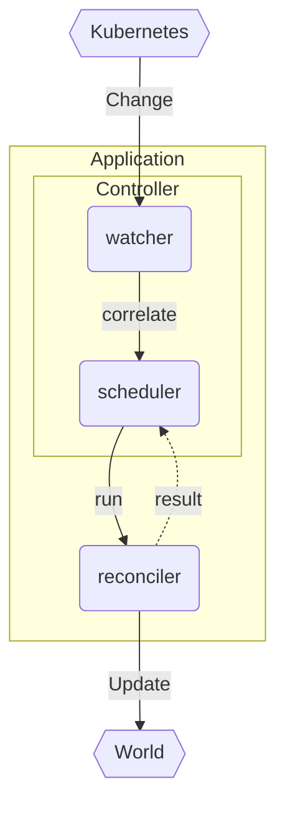

# The Reconciler

The reconciler is the user-defined function in charge of reconciling the object state with the **state of the world**.

```rust
async fn reconcile(o: Arc<K>, ctx: Context<T>) -> Result<Action, Error>
```

It is always called with the [[object]] type (here `K`) that you instantiate the [Controller] with, regardless of what auxillary objects you end up watching:



A [Controller] contains an internal machinery that will:

- watch the relevant api endpoints in Kubernetes
- map/correlate changes from those apis into your [[object]]
- schedule reconciliations (no parallel reconciliations of same object)
- call out to your `reconcile` function
- take the result of that reconciliation to decide when to reschedule

Notably, it's more than a simple watch that's glued to your reconciler. It's an infinite loop with tolerance for a wide class of failures, and a user-specifiable mechanism to correlate changes from different objects to your object.

## The World

The state of the world is generally one or more Kubernetes objects, possibly linked with [ownerReferences], but this is not always the case.

We say **state of the world** because you could control things **outside Kubernetes**; you could be dependent on some external api that you have semantically linked to your cluster. You could have populated this API from a custom resource - in which case you may want [finalizers] to ensure the api gets cleaned up on CRD deletion - or you could simply use this external API as an auxillary source of information.

The **relations** between your main [[object]] and **child objects** needs to be clearly defined for a controller to be most effective. These relations are defined with either [Controller::owns] or [Controller::watches]:

### Owned Relation

The [Controller::owns] relation is the most straight-forward and most ubiquitous one. One object controls the lifecycle of a child object, and cleanup happens automatically via [ownerReferences].

```rust
let cmgs = Api::<ConfigMapGenerator>::all(client.clone());
let cms = Api::<ConfigMap>::all(client.clone());

Controller::new(cmgs, ListParams::default())
    .owns(cms, ListParams::default())
```

This [configmapgen example](https://github.com/kube-rs/kube-rs/blob/master/examples/configmapgen_controller.rs) uses one custom resource `ConfigMapGenerator` whose controller is in charge of the lifecycle of the child `ConfigMap`.
Delete the `ConfigMapGenerator` instance? Kubernetes will automatically cleanup the associated `ConfigMap`, and the controller association/correlation is done using Kubernetes' own [ownerReferences] with no manual mapping logic required.

### Watched Relations

The [Controller::watches] relation is for related Kubernetes objects **without** [ownerReferences], i.e. without a standard way for the controller to map the object to the root object. Thus, you need to define this mapper yourself:

```rust
let main = Api::<MainObj>::all(client);
let related = Api::<RelatedObject>::all(client);

let mapper = |obj: RelatedObject| {
    obj.spec.object_ref.map(|oref| {
        ReconcileRequest::from(oref)
    })
};

Controller::new(main, ListParams::default())
    .watches(related, ListParams::default(), mapper)
```
<!-- TODO: ReconcileRequest::from sets reason to Unknow, needs a method to set reason, ReconcileReason -> controller::Reason -->

In this case we are extracing an object reference from the spec of our object. Regardless of how you get the information, your mapper must return an iterator of [ObjectRef] for the root object(s) that must be reconciled as a result of the change.

### External Relations

In the case of changes from an external api / 3rd party resource needing to trigger reconcilliations, you need to write some custom logic.

There's currently no way to inject non-Kubernetes watch streams into the Controller's machinery so the recommended way to watch 3rd party resources is to start it separately, and manually call `reconcile` when changes are detected.

<!-- TODO: maybe open an issue for Controller::external -->

### Relations Summary

| Child              | Controller relation  | Setup                  |  Cleanup          |
| ------------------ | -------------------- | ---------------------- | ----------------- |
| Kubernetes object  | Owned                | [Controller::owns]     | [ownerReferences] |
| Kubernetes object  | Related              | [Controller::watches]  | n/a               |
| External API       | Managed              | custom                 | [finalizers]      |
| External API       | Related              | custom                 | n/a               |

## Scheduling

The reconciler is invoked for some `object` by the [Controller] internals for a multitude of reasons:

- main object changed
- owned object changed
- related object/api changed
- failed reconciliation retriggered
- periodic reconciliation attempt triggered

Notice that the **reason** for why the reconciliation started is **not included** in the signature of `reconcile`; **you only get the object**. The reason for this omission is **fault-tolerance**.

!!! warning "Fault-tolerance against missed messages"

    If your controller is down / crashed earlier, you **might have missed messages**. In fact, **no matter how well** you guard against downtime (e.g with multiple replicas, rolling upgrades, pdbs, leases), the Kubernetes watch api is simply **not sufficiently safe** to guarantee unmissed messages (watch desyncs can happen and you never know you will have skipped an update). <!-- TODO; link to desync explanations -->

It is unsafe to give you a reason for why you got a `reconcile` call, because it is sometimes impossible to know.

Kube leans into this impossibility and hides this information from you, and in turn forces you to write a **defensive reconciler** where you **check everything**.

This also ends up being the right choice for error handling because of **what happens** if your reconciler **errored** half-way through a run; the only way you would know **what failed**, is if you check everything.

## Idempotency

The type of **defensive** function writing noted in <a href="#scheduling">scheduling</a> is intended to grant a formal property called **idempotency**.

!!! warning "A reconciler must be [idempotent](https://en.wikipedia.org/wiki/Idempotence)"

    If a reconciler is triggered twice for the same object, it should cause the same outcome. Care must be taken to not repeat expensive api calls when unnecessary, and the flow of the reconciler must be able to recover from errors occurring in a previous reconcile run.

In practice this means following a few guidelines:

- assume nothing about why reconciliation started
- check every property independently

so you should end up with a function that looks like:

```rust
async fn reconcile(object: Arc<MyObject>, data: Context<Data>) ->
    Result<ReconcilerAction, Error>
{
    let objs: Api<MyObject> = ctx.get_ref().api.clone();
    // TODO: big if let Some type chain here to illustrate

    Ok(ReconcilerAction {
        requeue_after: Some(Duration::from_secs(3600 / 2)),
    })
}
```

## Using Context

To do anything useful inside the reconciler like persisting your changes, you typically need to inject some client in there.

The way this is done is through the [Context] parameter on [Controller::run]. It's a simple `Arc` wrapper that you can put anything into.

```rust
// Context for our reconciler
#[derive(Clone)]
struct Data {
    /// kubernetes client
    client: Client,
    /// In memory state
    state: Arc<RwLock<State>>,
}

let context = Context::new(Data {
    client: client.clone(),
    state: state.clone(),
});
Controller::new(foos, ListParams::default())
    .run(reconcile, error_policy, context)
```

then you can pull out your user defined struct (here `Data`) items inside `reconcile`:

```rust
async fn reconcile(object: Arc<MyObject>, data: Context<Data>) ->
    Result<ReconcilerAction, Error>
{
    let client = ctx.get_ref().client.clone();
    ctx.get_ref().state.write().await.last_event = Utc::now();
    let reporter = ctx.get_ref().state.read().await.reporter.clone();
    let objs: Api<MyObject> = Api::all(client);
    // ...
    Ok(())
}
```

## Cleanup

Kubernetes provides **two methods of cleanup** of resources; the automatic [ownerReferences], and the manual (but safe) [finalizers].

We will talk about using these in a separate part. TODO.

## Instrumentation

### Observability

- tracing instrumentation of the fn
- metrics

### Diagnostics

- api updates to the `object`'s **status struct**
- `Event` records populated for diagnostic informatio


--8<-- "includes/abbreviations.md"
--8<-- "includes/links.md"

[//begin]: # "Autogenerated link references for markdown compatibility"
[object]: object "The Object"
[//end]: # "Autogenerated link references"
