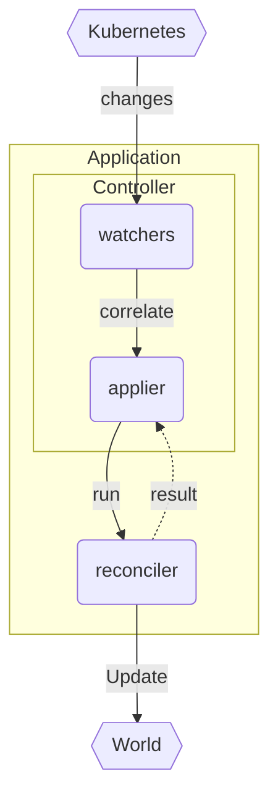

# The Reconciler

The reconciler is the user-defined function in charge of reconciling the object state with the **state of the world**.

```rust
async fn reconcile(o: Arc<K>, ctx: Context<T>) -> Result<Action, Error>
```

It is always called with the [[object]] type that you instantiate the [Controller] with, regardless of what auxillary objects you end up watching:



A [Controller] contains an internal machinery that will:

- watch api endpoints in Kubernetes (main object and related objects)
- map changes from those apis (via [[relations]]) into your main [[object]]
- schedule and apply reconciliations
- observe the result of reconciliations to decide when to reschedule
- tolerate a wide class of failures

We will treat [Controller] as a black-box, and leave out inner mechanisms in the [[internals]] page.

## The World

The state of the world is your main Kubernetes object along with **anything** your reconciler touches.

!!! warning "World need not be Kubernetes"

    While your **main** object **must** reside **within Kubernetes**, it is perfectly possibly to manage/act on changes **outside Kubernetes**.

## Configuring the World

Configuring the world involves setting up [[relations]] between your main object and whatever other thing you have.

Typically, this is accomplished with a call to [Controller::owns] on any owned [Api] and ensuring [ownerReferences] are created in your reconciler.

## Scheduling

The reconciler is invoked for an instance of your `object` by the [Controller] internals if:

- main object changed
- owned object changed
- related object/api changed
- failed reconciliation retriggered
- periodic reconciliation attempt triggered

Notice that the **reason** for why the reconciliation started is **not included** in the signature of `reconcile`; **you only get the object**. The reason for this omission is **fault-tolerance**.

!!! warning "Fault-tolerance against missed messages"

    If your controller is down / crashed earlier, you **might have missed messages**. In fact, **no matter how well** you guard against downtime (e.g with multiple replicas, rolling upgrades, pdbs, leases), the Kubernetes watch api is simply **not sufficiently safe** to guarantee unmissed messages (watch desyncs can happen and you never know you will have skipped an update). <!-- TODO; link to desync explanations -->

It is unsafe to give you a reason for why you got a `reconcile` call, because it is sometimes impossible to know.

Kube leans into this impossibility and hides this information from you, and in turn forces you to write a **defensive reconciler** where you **check everything**.

This also ends up being the right choice for error handling because of **what happens** if your reconciler **errored** half-way through a run; the only way you would know **what failed**, is if you check everything.

## Idempotency

The type of **defensive** function writing noted in <a href="#scheduling">scheduling</a> is intended to grant a formal property called **idempotency**.

!!! warning "A reconciler must be [idempotent](https://en.wikipedia.org/wiki/Idempotence)"

    If a reconciler is triggered twice for the same object, it should cause the same outcome. Care must be taken to not repeat expensive api calls when unnecessary, and the flow of the reconciler must be able to recover from errors occurring in a previous reconcile run.

In practice this means following a few guidelines:

- assume nothing about why reconciliation started
- check every property independently

so you should end up with a function that looks like:

```rust
async fn reconcile(object: Arc<MyObject>, data: Context<Data>) ->
    Result<ReconcilerAction, Error>
{
    let objs: Api<MyObject> = ctx.get_ref().api.clone();
    // TODO: big if let Some type chain here to illustrate

    Ok(ReconcilerAction {
        requeue_after: Some(Duration::from_secs(3600 / 2)),
    })
}
```

## Using Context

To do anything useful inside the reconciler like persisting your changes, you typically need to inject some client in there.

The way this is done is through the [Context] parameter on [Controller::run]. It's a simple `Arc` wrapper that you can put anything into.

```rust
// Context for our reconciler
#[derive(Clone)]
struct Data {
    /// kubernetes client
    client: Client,
    /// In memory state
    state: Arc<RwLock<State>>,
}

let context = Context::new(Data {
    client: client.clone(),
    state: state.clone(),
});
Controller::new(foos, ListParams::default())
    .run(reconcile, error_policy, context)
```

then you can pull out your user defined struct (here `Data`) items inside `reconcile`:

```rust
async fn reconcile(object: Arc<MyObject>, data: Context<Data>) ->
    Result<ReconcilerAction, Error>
{
    let client = ctx.get_ref().client.clone();
    ctx.get_ref().state.write().await.last_event = Utc::now();
    let reporter = ctx.get_ref().state.read().await.reporter.clone();
    let objs: Api<MyObject> = Api::all(client);
    // ...
    Ok(())
}
```

## Cleanup

Kubernetes provides **two methods of cleanup** of resources; the automatic [ownerReferences], and the manual (but safe) [finalizers].

We will talk about using these in a separate part. TODO.

## Instrumentation

### Observability

- tracing instrumentation of the fn
- metrics

### Diagnostics

- api updates to the `object`'s **status struct**
- `Event` records populated for diagnostic informatio


--8<-- "includes/abbreviations.md"
--8<-- "includes/links.md"

[//begin]: # "Autogenerated link references for markdown compatibility"
[object]: object "The Object"
[relations]: relations "Relations"
[internals]: internals "Internals"
[//end]: # "Autogenerated link references"
