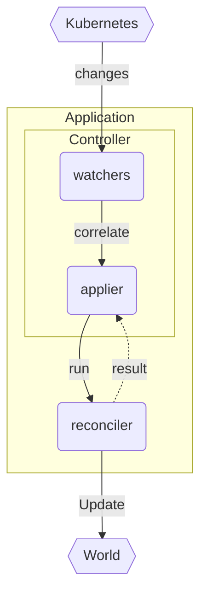

# The Reconciler

The reconciler is the **user-defined function** in charge of reconciling the **state of the world**.

```rust
async fn reconcile(o: Arc<K>, ctx: Arc<T>) -> Result<Action, Error>
```

It is always **called** with the [[object]] type that you instantiate the [Controller] with, independent of what auxiliary objects you may be watching:



A [Controller] is a system that will:

1. watch resources from the Kubernetes api (main + related objects)
2. `map` returned objects (via [[relations]]) into your main [[object]]
3. schedule and run reconciliations
4. observe the result of reconciliations to decide when to reschedule

> Details about this system is explored in [[internals]] and [[architecture]].

You must instantiate a [Controller] in your [[application]], and define your `reconcile` + `error_policy` fns.

## The World

The state of the world is your main Kubernetes object along with **anything** your reconciler touches.

!!! info "The World >= Kubernetes"

    While your **main** object **must** reside **within Kubernetes**, it is possible to manage/act on changes **outside Kubernetes**.

You do not have to configure the world, as any [side effect](https://en.wikipedia.org/wiki/Side_effect_(computer_science)) you perform implicitly becomes the world for your controller. It is, however, beneficial to specify any [[relations]] your object has with the world to ensure `reconcile` is correctly invoked:

## What triggers reconcile

The reconciler is invoked - for an instance of your `object` - if:

- that main object changed
- an owned object (with [ownerReferences] to the main object) changed
- a related object/api (pointing to the main object) changed
- the object had failed reconciliation before and was requeued earlier
- the object received an infrequent periodic reconcile request

In other words; `reconcile` will be triggered periodically (infrequently), and immediately upon changes to the main object, or related objects.

It is therefore beneficial to configure [[relations]] so the [Controller] will know what counts as a __reconcile-worthy__ change.

Typically, this is accomplished with a call to [Controller::owns] on any owned [Api] and ensuring [ownerReferences] are created in your reconciler. See [[relations]] for details.

## Reasons for reconciliation

Notice that the [ReconcileReason] is **not included** in the signature of `reconcile`; **you only get the object**. The reason for this omission is to encourage **fault-tolerance**:

!!! note "Fault-tolerance against missed messages"

    If your controller has downtime you can miss messages. Additionally, the Kubernetes watch api does not guarantee delivery. You will likely miss some messages, and when this happens, Kubernetes will coalesce the ones you have not received into one single message. <!-- TODO; link to desync explanations (watch desyncs can happen and you never know you will have skipped an update) -->

As a result, the [ReconcileReason] is a __debugging best-effort property__ (for telemetry). You should not attempt to write logic against the reason in your reconciler.

Instead, you must write a **defensive reconciler** and handle missed messages, and partial runs:

- assume nothing about why reconciliation started
- assume the reconciler could have failed at any question mark
- check every property independently (you always start at the beginning)

The type of **defensive** function writing described above is intended to grant a formal property called **idempotency**.

## Idempotency

A function is said to be **idempotent** if it can be applied multiple times without changing the result beyond the initial application.

!!! warning "A reconciler must be [idempotent]"

    If a reconciler is triggered twice for the same object, it must cause the same outcome. Care must be taken to ensure operations are not dependent on all-or-nothing approaches, and the flow of the reconciler must be able to recover from errors occurring in previous reconcile runs.

Let us create a reconciler for a custom `PodManager` resource that will:

- create an associated `Pod` with [ownerReferences]
- note its `creation` time on the status object of `PodManager`

Both of these operations are idempotent by themselves, but you must be careful with how you combine them.

### Combining Idempotent Operations

The naive approach to the above problem would be to **check if the work has been done**, and if not, do it:

```rust
if pod_missing {
    create_owned_pod()?;
    set_timestamp_on_owner()?;
}
```

Now, what happens if the timestamp creation fails after the pod got created? The second action will **never** get done!

!!! warning "Reconciler interruptions"

    If your reconciler **errored** half-way through a run; the only way you would know **what failed**, is if you check everything.

Therefore the correct way to do these two actions is to do them independently:

```rust
if pod_missing {
    create_owned_pod()?;
}
if is_timestamp_missing() {
    set_timestamp_on_owner()?;
}
```

### In-depth Solution

Let's suppose we have access to an `Api<Pod>` and an `Api<PodManager>` (via a <a href="#using-context">context</a>):

```rust
let api: Api<PodManager> = ctx.api.clone();
let pods: Api<Pod> = Api::default_namespaced(ctx.client.clone());
```

and let's define the `Pod` we want to create as:

```rust
fn create_owned_pod(source: &PodManager) -> Pod {
    let oref = source.controller_owner_ref(&()).unwrap();
    Pod {
        metadata: ObjectMeta {
            name: source.metadata.name.clone(),
            owner_references: Some(vec![oref]),
            ..ObjectMeta::default()
        },
        spec: my_pod_spec(),
        ..Default::default()
    }
}
```

one approach of achieving idempotency is to check every property carefully::

```rust
// TODO: find using ownerReferences instead - has to be done using jsonpath...
// {range .items[?(.metadata.ownerReferences.uid=262bab1a-1c79-11ea-8e23-42010a800016)]}{.metadata.name}{end}
// make a helper for this?
let podfilter = ListParams::default()
    .labels(format!("owned-by/{}", obj.name_any()));

// if owned pod is not created, do the work to create it
let pod: Pod = match &pods.list(&podfilter).await?[..] {
    [p, ..] => p, // return the first found pod
    [] => {
        let pod_data = create_owned_pod(&obj);
        pods.create(pod_data).await? // return the new pod from the apiserver
    },
};

if obj.status.pod_created.is_none() {
    // update status object with the creation_timestamp of the owned Pod
    let status = json!({
        "status": PodManagerStatus { pod_created: pod.meta().creation_timestamp }
    });
    api.patch_status(&obj.name_any(), &PatchParams::default(), &Patch::Merge(&status))
        .await?;
}
```

but we can actually simplify this significantly by taking advantage of idempotent Kubernetes apis:

```rust
let pod_data = create_owned_pod(&obj);
let serverside = PatchParams::apply("mycontroller");
let pod = pods.patch(pod.name_any(), serverside, Patch::Apply(pod_data)).await?

// update status object with the creation_timestamp of the owned Pod
let status = json!({
    "status": PodManagerStatus { pod_created: pod.meta().creation_timestamp }
});
api.patch_status(&obj.name_any(), &PatchParams::default(), &Patch::Merge(&status))
    .await?;
```

Here we are taking advantage of [Server-Side Apply] and deterministic naming of the owned pod to call the equivalent of `kubectl apply` on the `pod_data`.

The `patch_status` is already idempotent, and does not technically need the pre-check. However, we might wish to keep the check, as this will lead to less networked requests.


## Using Context

To do anything useful inside the reconciler like persisting your changes, you typically need to inject some client in there.

The way this is done is through the context parameter on [Controller::run]. It's whatever you want, packed in an `Arc`.

```rust
// Context for our reconciler
#[derive(Clone)]
struct Data {
    /// kubernetes client
    client: Client,
    /// In memory state
    state: Arc<RwLock<State>>,
}

let context = Arc::new(Data {
    client: client.clone(),
    state: state.clone(),
});
Controller::new(foos, watcher::Config::default())
    .run(reconcile, error_policy, context)
```

then you can pull out your user defined struct (here `Data`) items inside `reconcile`:

```rust
async fn reconcile(object: Arc<MyObject>, ctx: Arc<Data>) -> Result<Action, Error> {
    ctx.state.write().await.last_event = Utc::now();
    let reporter = ctx.state.read().await.reporter.clone();
    let objs: Api<MyObject> = Api::all(ctx.client.clone());
    // ...
    Ok(Action::await_change())
}
```

## Cleanup

If you have dependencies, you should configure some form of [[gc]].

## Instrumentation

The root `reconcile` function **should** be instrumented with logs, traces and metrics.

See the [[observability]] document for how to add good instrumentation to your `reconcile` fn.

### Diagnostics

WIP. Separate document for posting diagnostic events to the events api + using the status object.

--8<-- "includes/abbreviations.md"
--8<-- "includes/links.md"

[//begin]: # "Autogenerated link references for markdown compatibility"
[object]: object "The Object"
[relations]: relations "Related Objects"
[internals]: internals "Internals"
[architecture]: ../architecture "Architecture"
[application]: application "The Application"
[observability]: observability "Observability"
[//end]: # "Autogenerated link references"
