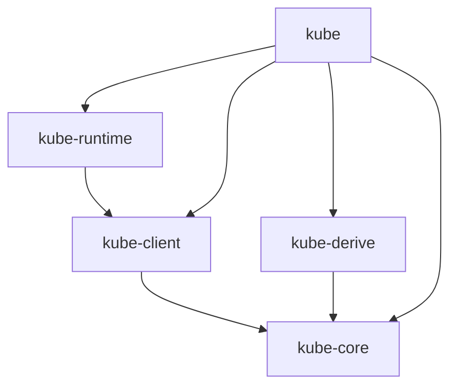

# kube

`kube` is the facade crate that re-exports all the other crates.

This crate has the most extensive documentation on [docs.rs/kube](https://docs.rs/kube/latest/kube/).

## Re-exports

- `kube` re-exports [[kube-runtime]] under `kube::runtime`
- `kube` re-exports [[kube-core]] under `kube::core`
- `kube` re-exports [[kube-derive]]'s proc macros onto `kube`
- `kube` re-exports [[kube-client]] (flattened) under `kube` (`kube::client` and `kube::config`)

[//begin]: # "Autogenerated link references for markdown compatibility"
[kube-runtime]: kube-runtime "kube-runtime"
[kube-core]: kube-core "kube-core"
[kube-derive]: kube-derive "kube-derive"
[kube-client]: kube-client "kube-client"
[//end]: # "Autogenerated link references"
